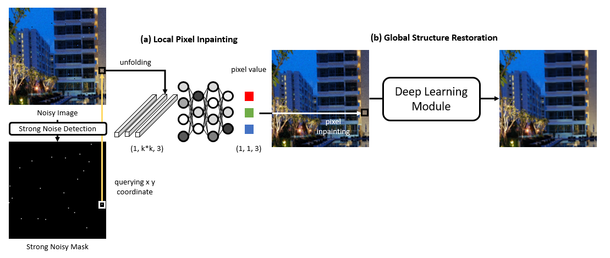
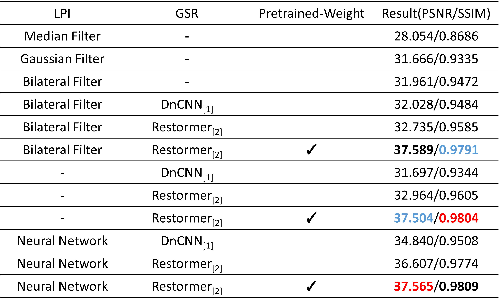

# Midterm-Project-Image-Denoise-AIC8003

This is an **"Advanced Image Processing"** course midterm project from NTNU.  
This project introduces a two-stage image restoration framework designed to handle different types of spatial noise distributions:

- Strong Noise with Low Spatial Distribution → Local Pixel Inpainting  
- Weak Noise with High Spatial Distribution → Global Structure Restoration  

The framework combines local pixel-level inpainting for severe localized noise with global structural restoration for spatially dispersed noise.

---

## Dataset and Pretrained Model

The dataset and pretrained model used in this project can be accessed at the following link:

[Google Drive – Dataset & Pretrained Model](https://drive.google.com/drive/folders/1qT0cmov-WGq1rFBi_g5u35nC3r3asLlU?usp=sharing)

This includes:
- Training and testing datasets with multiple noise-level variations  
- Pretrained weights for both the local inpainting and global restoration branches  

---

## Quantitative Results

The following figure shows the quantitative evaluation results in terms of PSNR and SSIM.

---

## Visual Comparisons

### One-Stage Method(PSNR/SSIM)

### Two-Stage Method(PSNR/SSIM)

These visual examples demonstrate that local pixel inpainting can preserve fine textures under strong localized noise, while global structure restoration ensures overall image coherence and tonal consistency.

---

## Model Highlights
- Local branch performs pixel-level inpainting to reconstruct regions with strong noise.  
- Global branch applies transformer-based modeling for global context and semantic consistency.  
- The final output fuses both results for balanced local detail and global smoothness.

---

## Citation

**DnCNN**  
Zhang, K., Zuo, W., Chen, Y., Meng, D., & Zhang, L. (2017).  
*Beyond a Gaussian Denoiser: Residual Learning of Deep CNN for Image Denoising.*  
IEEE Transactions on Image Processing, 26(7), 3142–3155.  
[DOI: 10.1109/TIP.2017.2662206](https://doi.org/10.1109/TIP.2017.2662206)

**Restormer**  
Zamir, S. W., Arora, A., Khan, S. H., Hayat, M., Khan, F. S., Yang, M.-H., & Shao, L. (2022).  
*Restormer: Efficient Transformer for High-Resolution Image Restoration.*  
CVPR 2022.  
[GitHub: swz30/Restormer](https://github.com/swz30/Restormer)

---

## Acknowledgment
This implementation draws inspiration from both DnCNN (residual CNN-based denoising) and Restormer (transformer-based global modeling), integrating their principles into a unified framework for adaptive noise repair.
